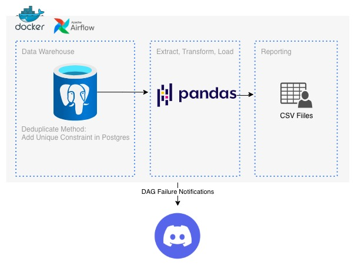

# 🚀 airflow-postgres-pandas-csv-report: Data Warehouse ETL Pipeline


## Overview

This repository contains a robust, **Dockerized Extract, Transform, Load (ETL) pipeline** designed to ingest data into a **PostgreSQL Data Warehouse**, perform transformations using **Pandas**, and output final results into easily consumable **CSV Reports**. The entire workflow is orchestrated using **Apache Airflow**, ensuring reliable scheduling, monitoring, and failure handling.

## ✨ Key Features

* **Orchestration:** Scheduled and managed ETL workflows using **Apache Airflow**.
* **Containerization:** Fully defined and isolated environment using **Docker** and **Docker Compose**.
* **Data Storage & Deduplication:** **PostgreSQL** serves as the Data Warehouse, enforcing data integrity using a **Unique Constraint** for seamless deduplication.
* **Data Transformation:** Efficient data processing and transformation utilizing the **Pandas** library.
* **Reporting Output:** Transformed data is loaded into static **CSV Files** for reporting.
* **Failure Notifications:** Immediate alerting on workflow (DAG) failures via **Discord**.

## 🏗️ Architecture and Technologies

| Component | Technology | Purpose |
| :--- | :--- | :--- |
| Orchestrator | **Apache Airflow** | Scheduling and monitoring the entire ETL DAG. |
| Containerization | **Docker** | Packaging the application and its dependencies (Airflow, Python/Pandas, Postgres). |
| Transformation | **Pandas** | Efficient manipulation and transformation of tabular data. |
| Data Storage | **PostgreSQL** | Primary Data Warehouse for source data and deduplication. |
| Reporting | **CSV Files** | Final output format for business reporting. |
| Alerts | **Discord** | Real-time notification system for DAG failures. |

## ⚙️ How to Run

### Prerequisites
* [Docker](https://www.docker.com/)
* [Docker Compose](https://docs.docker.com/compose/)

### Steps

1.  **Clone the repository:**
    ```bash
    git clone [your-repo-link]
    cd airflow-postgres-pandas-csv-report
    ```
2.  **Set Environment Variables:**
    * Create a `.env` file (refer to `.env.example`) to configure your PostgreSQL credentials and the Discord Webhook URL for notifications.
3.  **Start the Services:**
    Use Docker Compose to spin up Airflow, PostgreSQL, and other necessary services:
    ```bash
    docker-compose up -d
    ```
4.  **Access Airflow:**
    * Navigate to `http://localhost:8080` (or your configured port).
    * Log in with your credentials (e.g., `airflow`/`airflow`).
5.  **Enable the DAG:**
    * Find the `capstone2_sql_dag` DAG and manually trigger or enable its schedule.

